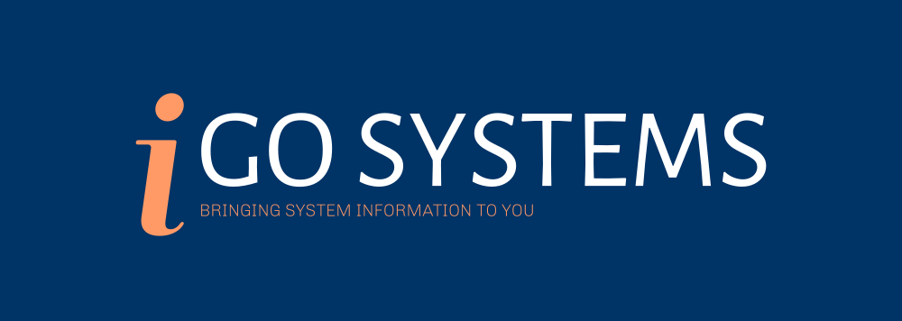

This program is built to use SMTP to send an email with your system information using GoLang. It uses environment
variables from a PowerShell script and accesses them when running a Go Program

## Dependencies
+ Go
  + Make sure the installation is referenced in your **PATH** environment variable
+ PowerShell
+ An **Outlook** email
  + Google took out the ability for insecure connections so outlook is currently the only way to send emails

## Installation
```
git clone https://github.com/Hanandrof/GoSystems.git
cd GoSystems
powershell script.ps1
```

## How It Works

This section is going to quickly talk about how everything works, it will be split into two sections, powershell and GO

### Powershell


### GO